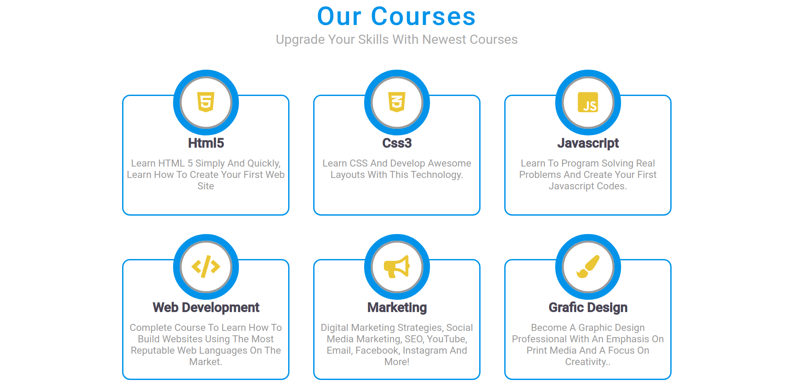

<h1 align="center">
    
</h1>

<h4 align="center"> 
	Web-Education Concluído
</h4>

## Sobre

A Web-Education é uma escola de cursos online voltados para a aréa da programação/
com objetivo de transfromar a vida de pessoas levando educação e tecnologia as pessoas/
de baixa renda.

## Funcionalidades

- [x] Os alunos podem acessar a plataforma web:
    - [x] para acessar nossos cursos de:
       - HTML5
       - CSS3
       - JavaScript
       - Desenvolvimento web
       - Marketing
       - Designer gráfico

- [x] Os usuários tem acesso ao aplicativo móvel, onde podem:
- [x] navegar pela plataforma de forma simples, clicando no menu ou arrastando a tela
- [x] Podem em contato com a entidade através do E-mail.

---

## Layout

Layout da Plataforma

### Mobile

<h1 align="center">
    
</h1>

<h1 align="center">
    
</h1>

## Web 

  
  
  
  
  
  

---

## tecnologias

CSS || HTML5 || JavaScript

## Licença

Este projeto esta sobre a licença [MIT](./LICENSE).

Feito com ❤️ por Jeferson Ferreira [Entre em contato!](www.linkedin.com/in/jeferson-ferreira2235)

